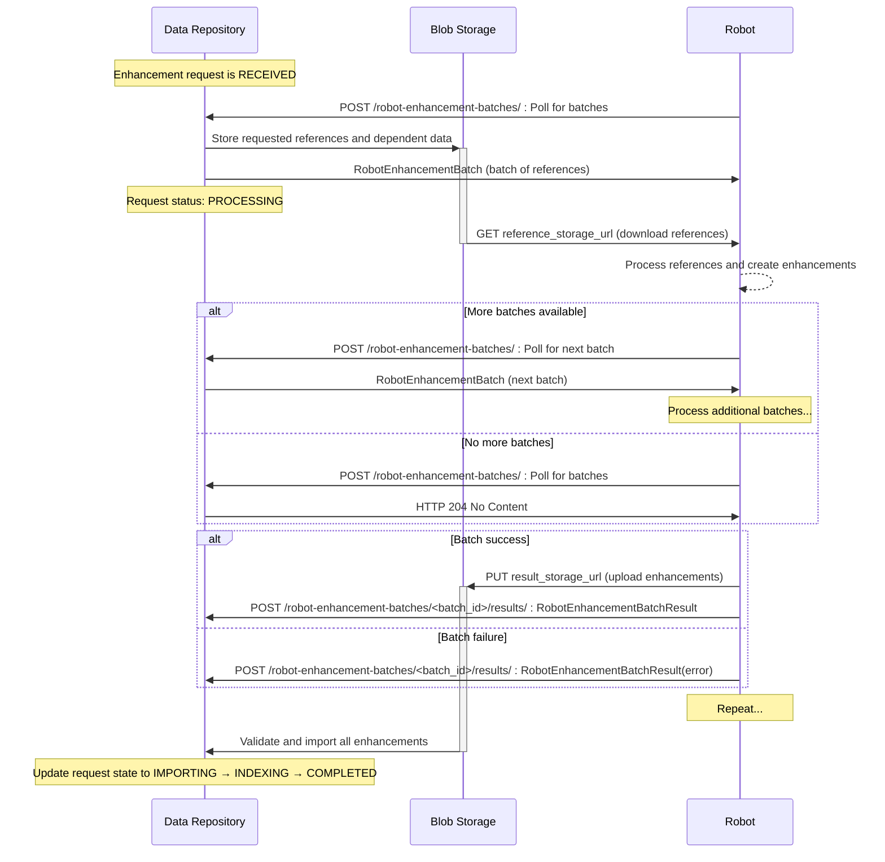

# Toy Robot

An example robot producing toy enhancements against destiny repository.

## Setup

### Requirements

[uv](https://docs.astral.sh/uv) is used for dependency management and managing virtual environments. You can install uv either using pipx or the uv installer script:

```sh
curl -LsSf https://astral.sh/uv/install.sh | sh
```

### Installing Dependencies

Once uv is installed, install dependencies:

```sh
uv sync
```

### Activate your environment

```sh
source .venv/bin/activate
```

## Development

Before commiting any changes, please run the pre-commit hooks. This will ensure that the code is formatted correctly and minimise diffs to code changes when submitting a pull request.

Install the pre-commit hooks:

```sh
uv run pre-commit install
```

pre-commit hooks will run automatically when you commit changes. To run them manually, use:

```sh
uv run pre-commit run --all-files
```

See [.pre-commit-config.yaml](.pre-commit-config.yaml) for the list of pre-commit hooks and their configuration.

### Configuration

Copy the example `.env.example` file:

```sh
cp .env.example .env
```

The robot can be configured using environment variables:

- `DESTINY_REPOSITORY_URL`: URL of the destiny repository to poll
- `ROBOT_ID`: The robot's client ID for authentication
- `ROBOT_SECRET`: The robot's secret key for HMAC authentication
- `POLL_INTERVAL_SECONDS`: How often to poll for new batches (default: 30)
- `BATCH_SIZE`: The number of references to include per enhancement batch (default: 5)

## Application

Run the robot:

```sh
uv run python run_robot.py
```

## Implemented request flow

### Robot Enhancement Batch Flow



## Authentication Against Destiny Repository

Authentication between the Toy Robot and Destiny Repository uses HMAC authentication, where a request signature is encrypted with the robot's secret key and set as a header. To simplify this process, the destiny_sdk provides a client for communicating with destiny repository that handles adding signatures. In Toy Robot the client is inititalised in [main.py](app/main.py) and used for sending requests.

### Configuring Authentication

- If you are running the toy robot with a local instance of destiny repository that is not enforcing authentication, add `ENV=local` to your `.env` file. This will cause the toy-robot to bypass authentication. This is to allow easy development only and the robot should not be deployed with `env=local`.
  - In this case you will need to set dummy values for the `ROBOT_ID` and the `ROBOT_SECRET`. For example `ROBOT_ID="9fa8b9bd-12b1-4450-affb-712face23390"` and `ROBOT_SECRET="dummy_secret"`
- If you want to deploy the Toy Robot and use it with destiny repository, the robot will need to be registered with that deployment of destiny repository. The registration process will provide the robot_id and client_secret needed to configure authentication. You can check out the proceedure for registering a robot [here](https://destiny-evidence.github.io/destiny-repository/procedures/robot-registration.html).

## Container Image

When building the docker image

```sh
docker buildx build --tag toy-robot .
```

Run the docker container

```sh
docker run -p 8001:8001 toy-robot
```

### Manual push

If you want to deploy the toy robot into Azure using the provided terraform infrastructure, you'll need to manually push the docker image to a container registry. We're using destiny-shared-infra for this.

```sh
az login
docker buildx build --platform linux/amd64 --tag destinyevidenceregistry.azurecr.io/toy-robot:[YOUR_TAG] .
az acr login --name destinyevidenceregistry
docker push destinyevidenceregistry.azurecr.io/toy-robot:YOUR_TAG
```

Then you can deploy your image to the container app

```sh
az containerapp update -n toy-robot-stag-app -g rg-toy-robot-staging --image estinyevidenceregistry.azurecr.io/toy-robot:YOUR_TAG
```

Then you can restart the revision with the following command

```sh
az containerapp revision restart --name toy-robot-stag-app --resource-group rg-toy-robot-staging --revision [REVISION_NAME]
```
