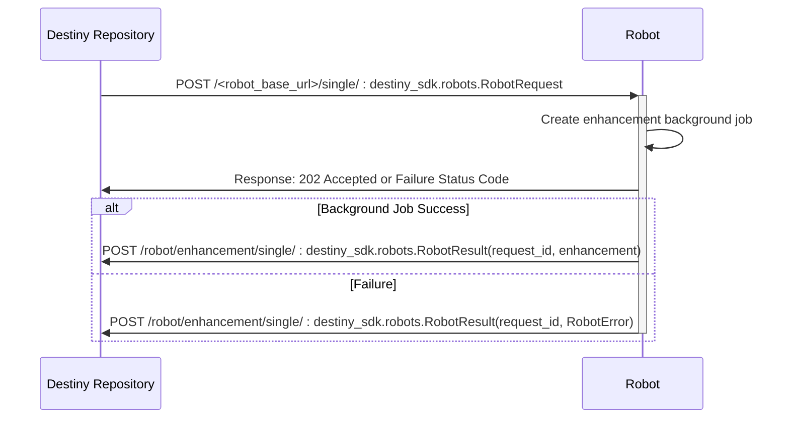
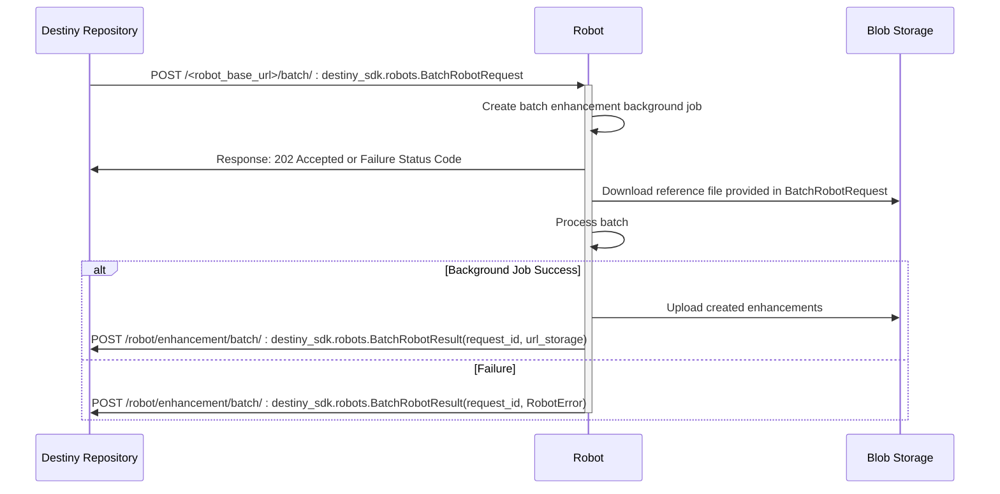

# Toy Robot

An example robot producing toy enhancements against destiny repository.

## Setup

### Requirements

[Poetry](https://python-poetry.org) is used for dependency management and managing virtual environments. You can install poetry either using pipx or the poetry installer script:

```sh
curl -sSL https://install.python-poetry.org | python3 -
```

### Installing Dependencies

We install the destiny_sdk directly from github, so you will need to have a github ssh key set up to be able to run poetry install.

Once Poetry is installed, install dependencies:

```sh
poetry install
```

## Development

Before commiting any changes, please run the pre-commit hooks. This will ensure that the code is formatted correctly and minimise diffs to code changes when submitting a pull request.

Install the pre-commit hooks:

```sh
poetry run pre-commit install
```

pre-commit hooks will run automatically when you commit changes. To run them manually, use:

```sh
poetry run pre-commit run --all-files
```

See [.pre-commit-config.yaml](.pre-commit-config.yaml) for the list of pre-commit hooks and their configuration.

## Application

Run the development server:

```sh
poetry run fastapi dev --port 8001
```

## Implemented request flows

### Single Enhancement Request Flow



### Batch Enhancement Request Flow



## Authentication Against Destiny Repository

Authentication between the Toy Robot and Destiny Repository uses HMAC authentication, where a request signature is encrypted with the robot's secret key and set as a header. To simplify this process, the destiny_sdk provides both a client for communicating with destiny repository that handles adding signatures, and a service auth that can be used to validate incoming requests.

In Toy Robot the client is inititalised in [main.py](app/main.py) and used for sending requests, the service auth is initialised in [auth.py](app/auth.py) and then used as a dependency on the app endpoints in [main.py](app/main.py)

### Configuring Authentication

- If you are running the toy robot with a local instance of destiny repository that is not enforcing authentication, add `ENV=local` to your `.env` file. This will cause the toy-robot to bypass authentication. This is to allow easy development only and the robot should not be deployed with `env=local`.
  - In this case you will need to set dummy values for the `ROBOT_ID` and the `ROBOT_SECRET`. For example `ROBOT_ID="9fa8b9bd-12b1-4450-affb-712face23390"` and `ROBOT_SECRET="dummy_secret"`
- If you want to deploy the Toy Robot and use it with destiny repository, the robot will need to be registered with that deployment of destiny repository. The registration process will provide the robot_id and client_secret needed to configure authentication. You can check out the proceedure for registering a robot [here](https://destiny-evidence.github.io/destiny-repository/procedures/robot-registration.html).

## Container Image

When building the docker image

```sh
docker buildx build --tag toy-robot .
```

This [mounts your github ssh key](https://docs.docker.com/reference/dockerfile/#example-access-to-gitlab) in the builder step so that poetry can install destiny_sdk from github.

If you run into trouble you might need to start the ssh agent.

### Manual push

If you want to deploy the toy robot into Azure using the provided terraform infrastructure, you'll need to manually push the docker image to a container registry. We're using destiny-shared-infra for this.

```sh
az login
docker buildx build --platform linux/amd64 --tag destinyevidenceregistry.azurecr.io/toy-robot:[YOUR_TAG] .
az acr login --name destinyevidenceregistry
docker push destinyevidenceregistry.azurecr.io/toy-robot:YOUR_TAG
```

Then you can deploy your image to the container app

```sh
az containerapp update -n toy-robot-stag-app -g rg-toy-robot-staging --image estinyevidenceregistry.azurecr.io/toy-robot:YOUR_TAG
```

Then you can restart the revision with the following command

```sh
az containerapp revision restart --name toy-robot-stag-app --resource-group rg-toy-robot-staging --revision [REVISION_NAME]
```
